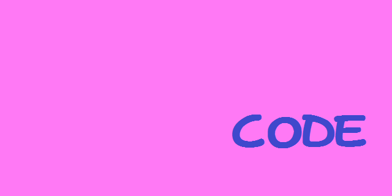

# Learn To CODE!
CODE (short for CODE Or DiE trying) is a brand-new programming language, designed to have the most user-friendly and compact syntax imaginable. It is inspired by some of the greatest and most widely-respected languages ever created, such as INTERCAL and PHP. For maximum flexibility, a javascript interpreter is provided, so you can write your own CODE code and run it with just a press of a button.

We also have a [Rust implementation](https://github.com/benwh1/CODE)!

# How?
See the docs/ folder for details on how to write in CODE.

# Versions
Version 2.1.2_math: Implemented a single convenient way to do all kinds of integer math.

Version 2.1.2: Implemented come from and indirect lhs.

Version 2.1.1: Implemented if statements.

Version 2.1: Implemented a better type system, booleans, functions, some operators, and two builtins.

Version 2.0: Implemented variables and a print statement.

Version 1.0: Implemented a README file.
